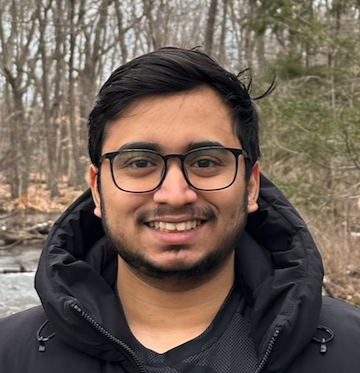

  
  

    <a href="mailto:kgudipaty@umass.edu" title="Email"><i class="fa fa-envelope"></i></a>
    <a href="https://www.linkedin.com/in/krishna-praneet/" title="LinkedIn" target="_blank"><i class="fab fa-linkedin"></i></a>
    <a href="https://github.com/krishna-praneet" title="GitHub" target="_blank"><i class="fab fa-github"></i></a>
    <a href="https://scholar.google.com/citations?user=iWacs9AAAAAJ&hl=en" title="Google Scholar" target="_blank"><i class="fa fa-graduation-cap"></i></a>
    <a href="https://leetcode.com/u/kpgudipaty/" title="LeetCode" target="_blank"><i class="fa fa-code"></i></a>
  

  
Preferred: Krishna (he/him)

  
pronounced: /ˈkrɪʃ.nə/ (krish-nuh)

  
kgudipaty [at] umass [dot] edu

## About

I'm pursuing a Ph.D. in Computer Science at the [University of Massachusetts Amherst](https://www.cics.umass.edu/), under the guidance of [Prof. Prashant Shenoy](https://people.cs.umass.edu/~shenoy/). As part of the [Laboratory for Advanced System Software (LASS)](https://lass.cs.umass.edu/), I am currently working on the design of failure-aware model serving system for Foundation Models. More broadly, my research interests include Machine Learning and Artifical Intelligence, Distributed Inference and training, fault-tolerance and resource management on the Edge/IoT. 

Prior to this, I have a 2.5+ years of experience as a Software Engineer at multiple firms including Deskera, Publicis Sapient and Boeing. I earned my Bachelors degree from the [Indian Institute of Technology Madras (IITM)](https://www.iitm.ac.in/) in 2020. 

## News

 |
-----|------
**May 2026** | Artifact Evaluator for OSDI 2026, Reviewer for *<ML Conference>*
**Mar 2026** | Artifact Evaluator for MLSys 2026 
**Jan 2026** | Reviewer for AISTATS 2026 
**Oct 2025** | Presented our work on Edge ML resilience at IEEE Milcom 2025, Los Angeles 
**Sep 2025** | [Considerations for Edge ML resilience](https://lass.cs.umass.edu/papers/pdf/milcom2025-practical.pdf) accepted to IEEE Milcom 2025 
**Jun 2025** | Multi-level ensemble Learning (MEL) is available on [arXiv](https://arxiv.org/abs/2506.20094) 
**Jul 2024** | Started my phd at UMass Amherst under Dr. Prashant Shenoy!
**May 2024** | Received my Masters degree from UMass Amherst!

<!-- ## Research Interest

Lorem ipsum dolor sit amet, consectetur adipiscing elit. Aliquam finibus ipsum ac erat aliquam dapibus. Vestibulum vehicula placerat ex, a consectetur odio pharetra quis. Mauris id urna ante. Fusce pharetra diam ac nisi aliquet, vel egestas ex iaculis. Pellentesque laoreet cursus tellus sed pellentesque. Praesent a rhoncus elit. Nunc ipsum nisl, consequat sit amet pretium quis, gravida id ipsum. -->

## Publications

1. **Gudipaty, Krishna Praneet**, W. A. Hanafy, L. Wu, et al., "Practical considerations for failure resilient ml systems at the edge," in *MILCOM 2025 - 2025 IEEE Military Communications Conference (MILCOM)*

2. **Gudipaty, Krishna Praneet**, W. A. Hanafy, K. Ozkara, et al., "Mel: Multi-level ensemble learning for resource-constrained environments," *arXiv preprint arXiv:2506.20094*, 2025

3. A. Micciche, **Gudipaty, Krishna Praneet**, and S. Krastanov, "Quantum ldpc error correcting codes for use on 1d quantum dot arrays," in *APS March Meeting Abstracts*, vol. 2024, S46–010

<!-- ## Typography

This is a [link](http://google.com). Something *italics* and something **bold**.

Here is a table

Year | Award | Category
-----|-------|--------
2014 | Emmy  | Won Outstanding Lead Actor in a miniseries or a movie
2015 | BAFTA | Nominated for Best Leading Actor for Sherlock
2014 | Satellite | Won Best Actor miniseries or television film

Here is a horizontal rule

---

Here is a blockquote

> To a great mind, nothing is little

## References

* Foo Bar: Head of Department, Placeholder Names, Lorem
* John Doe: Associate Professor, Department of Computer Science, Ipsum -->
